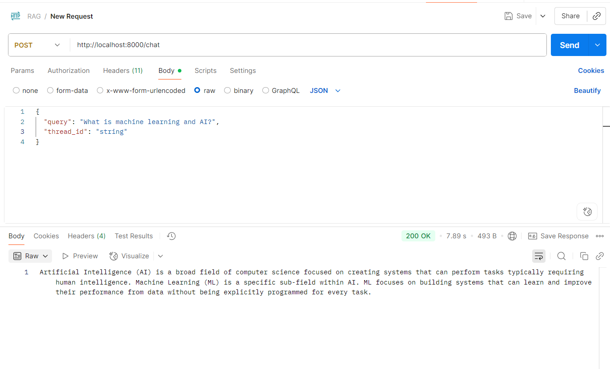
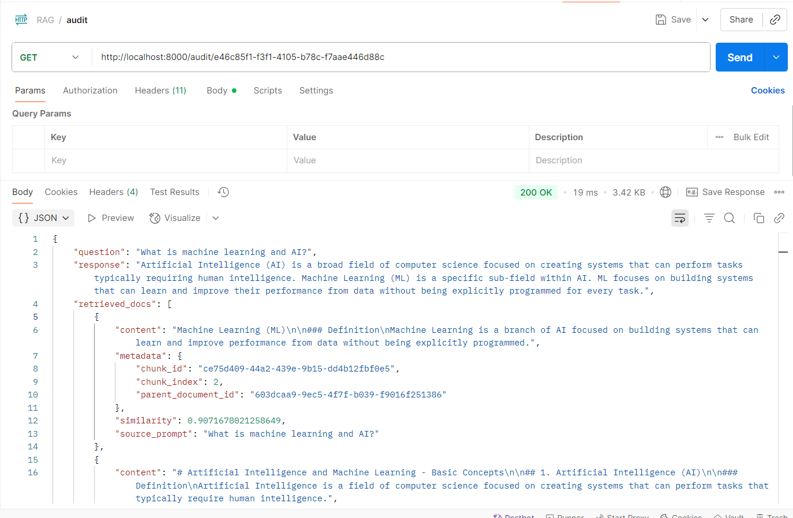

# RAG Knowledge Base System

A containerized knowledge base system built with FastAPI, PostgreSQL (pgvector), LangChain, and Gemini AI.

## 🚀 Quick Start

### Prerequisites
- Docker and Docker Compose
- Google API key for Gemini and Embeddings

### 1. Environment Setup
```bash
# Clone the repository
git clone https://github.com/myhoa011/interview-rag-system.git
cd rag

# Copy environment template
cp .env.example .env

# Edit .env with your Google API keys
POSTGRES_USER=postgres
POSTGRES_PASSWORD=123456
POSTGRES_DB=rag_db
POSTGRES_HOST=db
POSTGRES_PORT=5432

GOOGLE_API_KEY=your_google_api_key_here
```

### 2. Start the System
```bash
# Start all services with Docker Compose
docker compose up

# The system will:
# - Start PostgreSQL with pgvector extension
# - Initialize database tables
# - Start the FastAPI application
# - Be available at http://localhost:8000
```

### 3. Load Sample Data
```bash
# Upload sample AI/ML knowledge documents
curl -X POST "http://localhost:8000/knowledge/update" \
  -H "Content-Type: application/json" \
  -d @examples/sample_documents.json
```

### 4. Test the System
```bash
# Ask a question
curl -X POST "http://localhost:8000/chat" \
  -H "Content-Type: application/json" \
  -d '{"query": "What is machine learning?"}'
```

## 📋 API Endpoints

### Knowledge Management
- `POST /knowledge/update` - Upload documents to knowledge base
- `GET /knowledge` - List all documents
- `DELETE /knowledge/{document_id}` - Delete a document

### Chat & Query
- `POST /chat` - Ask questions (streaming response)

### Audit & Monitoring
- `GET /audit/{chat_id}` - Get chat interaction details

### System
- `GET /` - Welcome message
- `GET /health` - Health check
- `GET /docs` - Interactive API documentation

## 🔄 System Workflow

The system uses a multi-step approach to process queries:

1. **Query Expansion** - Generates multiple search perspectives
2. **Document Retrieval** - Finds relevant content using vector similarity
3. **Quality Assessment** - Analyzes information relevance and completeness
4. **Response Generation** - Streams answer from Gemini
5. **Memory Storage** - Saves insights for future reference

*For detailed technical implementation, see [ARCHITECTURE.md](./ARCHITECTURE.md)*

## 📊 Performance

- **Target**: < 500ms response time
- **Current**: 5-10 seconds average
- **Bottleneck**: External API calls and multi-step processing

## 🗃️ Database

The system uses PostgreSQL with pgvector extension for:
- **Document Storage**: Text content with vector embeddings
- **Audit Logging**: Complete interaction tracking
- **Metadata**: Flexible JSONB fields for document attributes

*See [ARCHITECTURE.md](./ARCHITECTURE.md) for detailed schema and design decisions.*

## 🧪 API Testing Examples

The `examples/` directory contains screenshots of API testing using Postman:

### Knowledge Management

*Uploading documents to the knowledge base*


*Retrieving all documents from the knowledge base*


*Deleting a specific document*

### Chat Interface

*Asking questions and receiving AI responses*

### Audit Tracking

*Viewing detailed interaction logs*

## 🛠️ Development

### Local Development (without Docker)
```bash
# Install dependencies
uv sync

# Set up environment variables
cp .env.example .env

# Start PostgreSQL (with pgvector)
# Update .env with your database connection

# Run the application
uv run uvicorn src.main:app --reload --host 0.0.0.0 --port 8000
```

### Project Structure
```
src/
├── main.py              # FastAPI application
├── router/              # API endpoints
│   ├── knowledge.py     # Document management
│   ├── chat.py          # Chat interface
│   └── audit.py         # Audit logs
├── services/            # Business logic
│   ├── chat.py          # LangGraph workflow
│   ├── vector_store.py  # Database operations
│   └── embedding.py     # Text processing
├── models/              # Data models
└── db/                  # Database configuration

examples/
├── sample_documents.json # Sample AI/ML knowledge
└── *.png               # API testing screenshots
```

## 🔧 Configuration

### Environment Variables
- `GOOGLE_API_KEY` - Google Gemini API key
- `POSTGRES_USER` - Database username
- `POSTGRES_PASSWORD` - Database password
- `POSTGRES_DB` - Database name
- `POSTGRES_HOST` - Database host
- `DATABASE_URL` - Full database connection string (optional)

### Docker Services
- **db**: PostgreSQL 17 with pgvector extension
- **api**: FastAPI application with hot reload

## 📝 API Documentation

Once the system is running, visit:
- **Interactive Docs**: http://localhost:8000/docs
- **ReDoc**: http://localhost:8000/redoc

## 🔍 Monitoring

The system provides comprehensive audit logging:
- All chat interactions are logged
- Response times are tracked
- Retrieved documents are recorded
- User feedback can be collected

## 🚧 Current Limitations

- Response time: 5-10 seconds (target: <500ms)
- External API dependencies (Google services)
- Sequential processing workflow
- Limited to English content

For detailed architecture and design decisions, see [ARCHITECTURE.md](./ARCHITECTURE.md).
